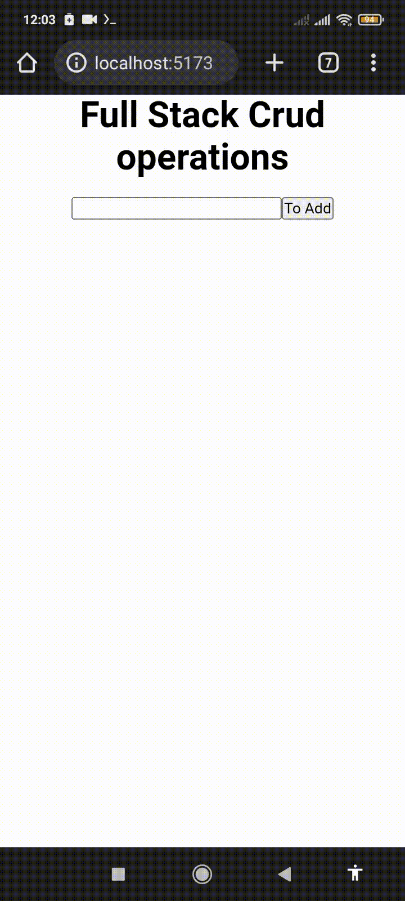

<h2 align="center"> CRUD Operations </h2>
<h2 align="center"> MERN Stack </h2>

<p align="center">
Um projeto simples desenvolvido observando um tutorial Indiano do YouTube. Decidi fazê-lo com objetivo de aprender mais sobre essas tecnologias.
<br/>
</p>

- [Overview](#overview)
  - [Sobre o projeto](#sobre)
  - [Screenshots](#screenshots)
  - [Como utilizar](#links)
- [My process](#my-process)
  - [Desenvolvido com](#tecnologias)
  - [Continuar o desenvolvimento](#continuar-o-desenvolvimento)
  - [Recursos úteis](#recursos-úteis)
- [Author](#autor)


</br>

## Overview
### Sobre
CRUD (Create, Read, Update, Delete) é um acrônimo para as maneiras de se operar em informações armazenadas seja em um banco de dados, ou na sua máquina ou na nuvem. No casso desse projeto, as informações ficam armazenadas em um banco de dados Mongo. A stack MERN (MongoDB, Express, React, Node) é uma coleção de tecnologias que permite o desenvolvimento mais rápido de aplicativos. Ele é usado por desenvolvedores em todo o mundo. O principal objetivo do uso da stack MERN é desenvolver aplicativos usando apenas JavaScript. Ou seja, como quero trabalhar mais com o JavaScript decidi então fazer esse tutorial utilizando essas tecnologias, espero aprender cada vez mais sobre elas.

### Screenshots
<p align="center">
  
</p>

### Como utilizar
Clone o repositório:
```bash
gh repo clone JoaoAlisonTI/crud-full-stack-operations
```
Entre nas pastas frontend e backend e instale as dependências com: 
```bash
npm i
```
Execute o backend com:
```bash
npm run dev
```
Execute o frontend com: 
```bash
npm run dev
```
Após isso abra o link do localhost.
</br>

## My process
### Tecnologias
### ⚙️👨‍💻
Esse projeto foi desenvolvido com as seguintes tecnologias:

- MongoDB
- Express
- React
- Node
- Git e Github

### Continuar o aprendizado
Pretendo aprender mais com esse código, conseguir pegar ele e modificá-lo para aplica-lo em outras ideias 💡

### Recursos úteis
- [Full Stack CRUD Operations | React, Node, Express & MongoDB](https://youtu.be/xElA9mGi-I0) - O vídeo-tutorial do canal The Brave Coders.
- [All You Need To Know About MERN Stack](https://www.simplilearn.com/tutorials/mongodb-tutorial/what-is-mern-stack-introduction-and-examples#:~:text=MERN%20stack%20is%20a%20collection,stack%20are%20all%20JS%2Dbased.) - MERN Stack is a compilation of four different technologies that work together to develop dynamic web apps and websites.
- [What is the MERN stack?](https://www.mongodb.com/mern-stack) - MERN stands for MongoDB, Express, React, Node, after the four key technologies that make up the stack.
- [Learn CRUD Operations in JavaScript by Building TODO APP](https://www.freecodecamp.org/news/learn-crud-operations-in-javascript-by-building-todo-app/) - CRUD é um tipo de mecanismo que permite criar dados, ler dados, editá-los e excluí-los. Neste caso vai ser abordado sobre um app Todo, mas como também utiliza as 4 operações CRUD ele também se torna importante para entender os seus princípios.

</br>

## Autor
*João Alison TI 👨🏽‍💻*

---

<strong>2023</strong>